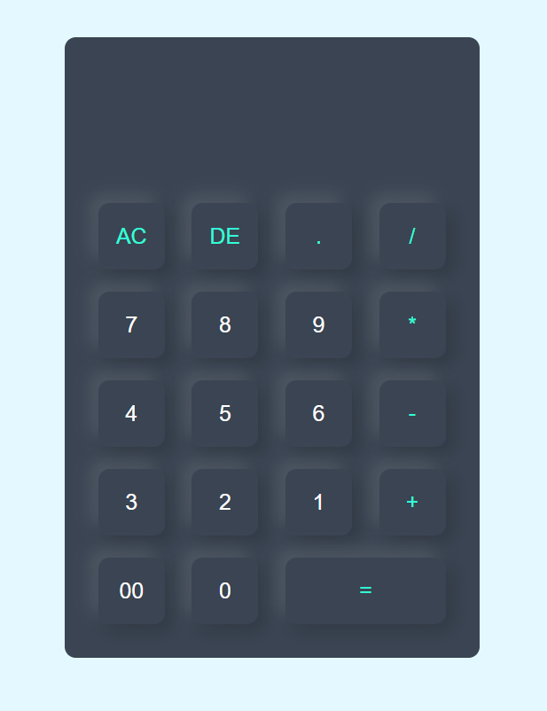

# Calculator 🧮

## Overview
The *Calculator* is a simple web application that provides basic arithmetic calculations. Users can perform addition, subtraction, multiplication, and division using the intuitive user interface.

## Technologies Used
- HTML
- CSS (FlexBox)
- JavaScript

## Features
1. **Basic Arithmetic Operations:**
   - Addition, Subtraction, Multiplication, Division.
2. **Clear and Delete:**
   - "AC" button clears the display.
   - "DE" button deletes the last entered digit.
3. **Decimal Point:**
   - Allows users to input decimal numbers.
4. **Responsive Design:**
   - The calculator is designed to be responsive and user-friendly on various devices.

## Usage
1. **Numeric Input:**
   - Click on the numeric buttons to input numbers.
2. **Arithmetic Operations:**
   - Use the corresponding operation buttons (+, -, *, /) to perform calculations.
3. **Clear and Delete:**
   - AC: Clears the entire display.
   - DE: Deletes the last entered digit.
4. **Decimal Point:**
   - Click on the "." button to input decimal numbers.
5. **Result:**
   - Click "=" to display the result of the calculation.

   

## Live Demo
Live Demo: [Calculator Demo](https://calculator-ten-teal.vercel.app/)

## Installation
No special installation is required for this project. Simply download the project files and open the `index.html` file in a web browser.

## Contributing
Feel free to use, modify, and contribute to the project! If you have any questions or feedback, you can reach me at nisagokdemir@gmail.com

## License
This project is licensed under the **MIT License**.
